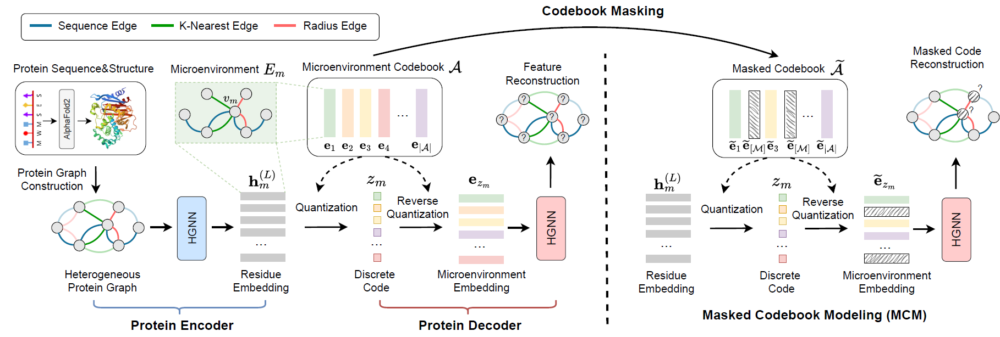

# MAPE-PPI
**MAPE-PPI: Towards Effective and Efficient Protein-Protein Interaction Prediction via Microenvironment-Aware Protein Embedding (Spotlight)**

Lirong Wu, Yijun Tian, Yufei Huang,  Siyuan Li, Haitao Lin, Nitesh V Chawla, Stan Z. Li. In [ICLR](https://openreview.net/forum?id=itGkF993gz), 2024.

<p align="center">
  
</p>


## Dependencies

```
conda env create -f environment.yml
conda activate MAPE-PPI
```
The default PyTorch version is 2.0.0 and cudatoolkit version is 11.7. They can be changed in `environment.yml`.


## Dataset

**Raw data** of the three datasets (SHS27k, SHS148k, and STRING) can be downloaded from the [Google Drive](https://drive.google.com/file/d/1hJVrQXddB9JK68z7jlIcLfd9AmTWwgJr/view?usp=sharing):

* `protein.STRING.sequences.dictionary.tsv`      Protein sequences of STRING
* `protein.actions.STRING.txt`     PPI network of STRING
* `STRING_AF2DB`     PDB files of protein structures predicted by AlphaFold2

Pre-process raw data to generate feature and adjacency matrices (also applicable to any new dataset):
```
python ./raw_data/data_process.py --dataset data_name
```
where `data_name` is one of the three datasets (SHS27k, SHS148k, and STRING).


For ease of use, we have pre-processed these three datasets and placed the **processed data** in [Google Drive](https://drive.google.com/file/d/16JkdWJ92jy_kVGc92ngXlLKbcSLAPu0P/view?usp=sharing). 

To use the processed data, please put them in `./data/processed_data/.


## Usage

### Pre-training and Inference on SHS27k/SHS148k/STRING

```
python -B train.py --dataset STRING --split_mode bfs
```

The hyperparameters customized for each dataset and data partitions are available in `./configs/param_config.json`.


### Pre-training on additional data, Inference on SHS27k/SHS148k/STRING

To pre-train with customized data (e.g., CATH or AlphaFoldDB datasets), please refer to the following steps:

(1) Download additional pre-training data (including their PDF files) from the official website.

(2) Pre-process pre-training PDB files as done in `./raw_data/data_process.py` and transform into three files:

* `protein.nodes.pretrain_data.pt`
* `protein.rball.edges.pretrain_data.npy`
* `protein.knn.edges.pretrain_data.npy`

where `pretrain_data` is the name of the additional pre-training dataset.

(3) Load pre-processed data and perform pretraining on it, running

```
python -B train.py --dataset STRING --split_mode bfs --pre_train pretrain_data
```


### Loading the pre-trained model and Inference on SHS27k/SHS148k/STRING

We provide a pre-trained model in `./trained_model/`  for PPI prediction on STRING. To use it, please run

```
python -B train.py --dataset STRING --split_mode bfs --ckpt_path ../trained_model/vae_model.ckpt
```


## Citation

If you are interested in our repository and our paper, please cite the following paper:

```
@article{wu2024mape,
  title={MAPE-PPI: Towards Effective and Efficient Protein-Protein Interaction Prediction via Microenvironment-Aware Protein Embedding},
  author={Wu, Lirong and Tian, Yijun and Huang, Yufei and Li, Siyuan and Lin, Haitao and Chawla, Nitesh V and Li, Stan Z},
  journal={arXiv preprint arXiv:2402.14391},
  year={2024}
}
```

## Feedback

If you have any issue about this work, please feel free to contact me by email: 
* Lirong Wu: wulirong@westlake.edu.cn
